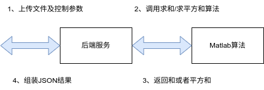

# octaveserver

### 说明

该服务将Matlab算法封装为服务并提供Restful-HTTP接口

1. server-上传CSV文件，文件中包括N行M列个元素，同时传入控制参数，控制调用算法的类型。
2. matlab-实际调用Matlab算法(type=1 求和  type=2 求平方和)
3. matlab-返回结果
4. server-JSON组装结果返回



### 编译

```bash
docker build -t octaveserver:v1.0  .
```
### 运行

```bash
docker run --restart=always -itd \
-p 8630:8630 --name octaveserver octaveserver:v1.0
```
### 测试
（1）查看版本号
```bash
 curl -v http://localhost:8630/version

* Mark bundle as not supporting multiuse
< HTTP/1.1 200 OK
< Content-Type: application/json; charset=utf-8
< Date: Fri, 23 Dec 2022 07:02:22 GMT
< Content-Length: 44
< 
* Connection #0 to host localhost left intact
{"version":"v1.0.1","updateat":"2022-12-23"}
```

（2）调用求和算法
```bash
curl -X POST -v --form calc=1 --form "matrix=@./matrix.csv" http://localhost:8630/octave

> 
* We are completely uploaded and fine
* Mark bundle as not supporting multiuse
< HTTP/1.1 200 OK
< Content-Type: application/json; charset=utf-8
< Date: Fri, 23 Dec 2022 09:18:23 GMT
< Content-Length: 32
< 
* Connection #0 to host localhost left intact
{"code":0,"msg":"","result":100}
```

（3）调用求平方和算法
```bash
curl -X POST -v --form calc=2 --form "matrix=@./matrix.csv" http://localhost:8630/octave

* We are completely uploaded and fine
* Mark bundle as not supporting multiuse
< HTTP/1.1 200 OK
< Content-Type: application/json; charset=utf-8
< Date: Fri, 23 Dec 2022 09:19:34 GMT
< Content-Length: 32
< 
* Connection #0 to host localhost left intact
{"code":0,"msg":"","result":642}
```

